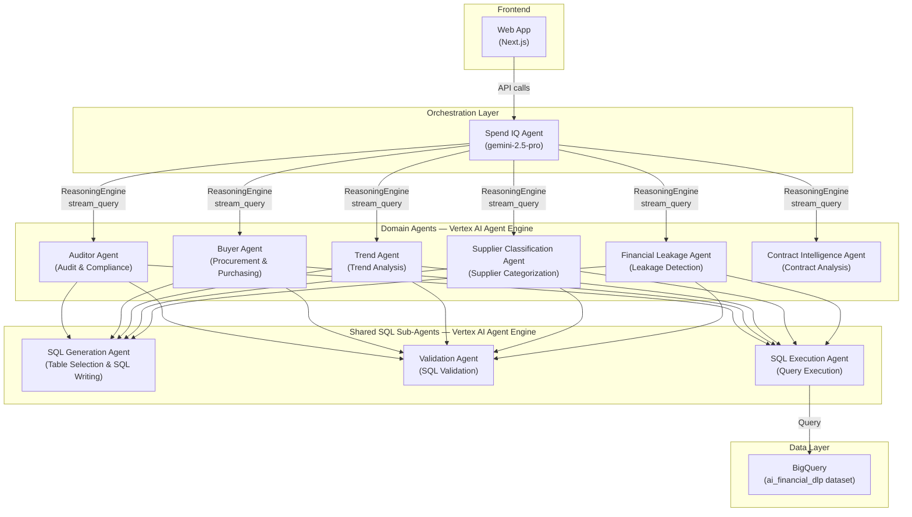

# Supplier Cost Optimization — AI Agent System

> **EY GDS Internship Project** | Google Cloud Platform · Vertex AI · Agent Development Kit

---

## Overview

This repository contains the source code and infrastructure configuration for the **Supplier Cost Optimization (SCO) AI Agent System** — a multi-agent architecture deployed on Google Cloud's Vertex AI Agent Engine.

The system leverages Google's Agent Development Kit (ADK) to orchestrate a network of specialized AI agents, each responsible for a distinct analytical domain within supplier spend management. Agents communicate via the Vertex AI Reasoning Engine API, querying structured financial data stored in BigQuery to deliver intelligent, context-aware responses to procurement and audit queries.

---

## System Architecture



---

## Repository Structure

```
GCP_Multiagent_Sandbox/
├── infra/
│   ├── agents/                          # Python source code for each AI agent
│   │   ├── spend_iq_agent/              # Orchestrator agent (entry point)
│   │   ├── auditor_agent/               # Audit & compliance domain agent
│   │   ├── buyer_agent/                 # Procurement & purchasing domain agent
│   │   ├── trend_agent/                 # Spend trend analysis domain agent
│   │   ├── supplier_classification_agent/
│   │   ├── financial_leakage_agent/
│   │   ├── contract_intelligence_agent/
│   │   ├── sql_generation_agent/        # Shared SQL sub-agent
│   │   ├── validation_agent/            # Shared SQL sub-agent
│   │   └── sql_execution_agent/         # Shared SQL sub-agent
│   ├── modules/                         # Reusable Terraform modules
│   ├── sandbox/                         # Standalone sandbox Terraform configuration
│   └── *.tf                             # Per-agent Terraform deployment files
├── web-app/                             # Next.js frontend application
├── scripts/
│   ├── deploy_agents.py                 # Automated agent deployment script
│   └── load_sandbox_bq_data.py          # BigQuery sample data loader
├── tests/                               # Agent test suites
├── pyproject.toml                       # Python project configuration (uv/hatchling)
└── .env.example                         # Environment variable template
```

---

## Technology Stack

| Layer | Technology |
|---|---|
| AI Orchestration | Google Agent Development Kit (ADK) |
| Agent Hosting | Vertex AI Agent Engine (Reasoning Engine) |
| LLM | Gemini 2.5 Pro |
| Data Warehouse | BigQuery |
| Infrastructure as Code | Terraform |
| Frontend | Next.js (React) |
| Python Package Manager | uv |
| Observability | OpenTelemetry + Google Cloud Logging |

---

## Prerequisites

The following tools must be installed and configured before proceeding with deployment.

| Tool | Minimum Version | Purpose |
|---|---|---|
| Google Cloud SDK (`gcloud`) | Latest | Authentication & project configuration |
| Terraform | 1.5+ | Infrastructure provisioning |
| Python | 3.10 – 3.12 | Agent runtime |
| `uv` | Latest | Python dependency management |
| Node.js | 18+ | Web application development server |

---

## Deployment Guide

> **Note:** Deployment must be performed from a machine with authorized access to the target GCP sandbox project. Ensure all required IAM roles have been granted before proceeding.

### Step 1 — Authenticate with Google Cloud

```bash
# Authenticate your user account
gcloud auth login

# Configure Application Default Credentials (required by Python agents)
gcloud auth application-default login

# Set the active project
gcloud config set project <YOUR_GCP_PROJECT_ID>
```

### Step 2 — Configure Environment Variables

```bash
# Copy the environment template
cp .env.example .env
```

Edit `.env` and populate the required values:

```bash
# Windows PowerShell
$env:GOOGLE_CLOUD_PROJECT = "your-gcp-project-id"
$env:GOOGLE_CLOUD_LOCATION = "us-central1"
```

### Step 3 — Provision the Data Layer (Terraform)

```bash
cd infra/sandbox

# Copy and populate the Terraform variables file
cp terraform.tfvars.example terraform.tfvars
# Edit terraform.tfvars with your project_id, region, and dataset_location

# Initialize Terraform providers
terraform init

# Preview the planned changes
terraform plan

# Apply the infrastructure
terraform apply
```

This step provisions:
- BigQuery datasets (`ai_financial_dlp`, `gemini_enterprise`)
- Core financial data tables (`AP_INVOICES_ALL`, `AP_SUPPLIERS`, `XXC_GL_SUMMARY`, `XXC_GL_DIV_REG_FAC`)
- GCS bucket for schema template files
- Required GCP API enablement

### Step 4 — Load Sample Data

```bash
cd ../..
python scripts/load_sandbox_bq_data.py --project <YOUR_GCP_PROJECT_ID>
```

### Step 5 — Install Python Dependencies

```bash
# From the project root
uv sync
```

### Step 6 — Deploy Agents to Vertex AI

Agents must be deployed in dependency order. The provided script handles this automatically:

```bash
# Deploy all agents in sequence
python scripts/deploy_agents.py

# Deploy a specific agent only
python scripts/deploy_agents.py --agent auditor_agent

# Deploy and immediately run a validation test
python scripts/deploy_agents.py --test

# List all previously deployed agents
python scripts/deploy_agents.py --list-deployed
```

> **Important:** The `spend_iq_agent` (orchestrator) must be deployed last, after all domain and SQL sub-agents are available. The deployment script enforces this order automatically. Deployed resource names are persisted to `deployed_agents_state.json` after each successful deployment.

**Required Deployment Order:**

1. `sql_generation_agent`
2. `validation_agent`
3. `sql_execution_agent`
4. `auditor_agent`
5. `buyer_agent`
6. `trend_agent`
7. `supplier_classification_agent`
8. `financial_leakage_agent`
9. `contract_intelligence_agent`
10. `spend_iq_agent` ← Orchestrator, deploy last

### Step 7 — Validate Agent Responses

```bash
# Test a specific deployed agent
python scripts/deploy_agents.py --test-only "projects/<PROJECT>/locations/us-central1/reasoningEngines/<ID>"
```

Or programmatically via Python:

```python
import vertexai

vertexai.init(project="<YOUR_PROJECT_ID>", location="us-central1")

agent = vertexai.agent_engines.get(
    "projects/<PROJECT>/locations/us-central1/reasoningEngines/<SPEND_IQ_ID>"
)

for chunk in agent.stream_query(
    message="What are the top 5 suppliers by total spend this quarter?",
    user_id="test-user"
):
    print(chunk)
```

### Step 8 — Run the Web Application

```bash
cd web-app
npm install
npm run dev
# Application available at http://localhost:3000
```

---

## Sandbox Environment

The `infra/sandbox/` directory contains a self-contained Terraform configuration for GCP sandbox deployment, intentionally decoupled from the production CI/CD pipeline.

The sandbox configuration:
- Targets a pre-existing GCP sandbox project (does not create a new project)
- Enables all required APIs: BigQuery, AI Platform, Cloud Storage, Firestore, and related services
- Creates the `ai_financial_dlp` and `gemini_enterprise` BigQuery datasets
- Uploads markdown schema templates to a GCS bucket for agent context
- Provisions core BigQuery table schemas for sandbox testing

Refer to [`infra/sandbox/README.md`](infra/sandbox/README.md) for detailed sandbox-specific instructions.

---

## Agent Descriptions

| Agent | Domain | Responsibility |
|---|---|---|
| **Spend IQ Agent** | Orchestration | Routes user queries to the appropriate domain agent; aggregates responses |
| **Auditor Agent** | Audit & Compliance | Identifies anomalies, duplicate payments, and policy violations |
| **Buyer Agent** | Procurement | Analyses purchasing patterns, PO compliance, and buyer behaviour |
| **Trend Agent** | Spend Analysis | Detects spend trends across time periods, categories, and facilities |
| **Supplier Classification Agent** | Vendor Management | Categorises suppliers by type, risk profile, and spend tier |
| **Financial Leakage Agent** | Cost Control | Identifies financial leakage, unapproved spend, and contract deviations |
| **Contract Intelligence Agent** | Contract Analysis | Analyses contract terms and compliance against invoiced amounts |
| **SQL Generation Agent** | Shared Utility | Selects relevant tables and generates optimised BigQuery SQL |
| **Validation Agent** | Shared Utility | Reviews and validates generated SQL before execution |
| **SQL Execution Agent** | Shared Utility | Executes validated SQL against BigQuery and returns structured results |

---

## Environment Variables Reference

| Variable | Required | Description |
|---|---|---|
| `GOOGLE_CLOUD_PROJECT` | Yes | GCP project ID for Vertex AI and BigQuery |
| `GOOGLE_CLOUD_LOCATION` | No | GCP region (default: `us-central1`) |
| `AGENT_STAGING_BUCKET` | No | GCS bucket for ADK deployment staging |
| `AUDITOR_AGENT_RESOURCE` | Yes (Spend IQ) | Full Reasoning Engine resource name for Auditor Agent |
| `BUYER_AGENT_RESOURCE` | Yes (Spend IQ) | Full Reasoning Engine resource name for Buyer Agent |
| `TREND_AGENT_RESOURCE` | Yes (Spend IQ) | Full Reasoning Engine resource name for Trend Agent |
| `SUPPLIER_CLASSIFICATION_AGENT_RESOURCE` | Yes (Spend IQ) | Full Reasoning Engine resource name for Supplier Classification Agent |
| `FINANCIAL_LEAKAGE_AGENT_RESOURCE` | Yes (Spend IQ) | Full Reasoning Engine resource name for Financial Leakage Agent |
| `SQL_GENERATION_AGENT_RESOURCE` | Yes (Domain Agents) | Full Reasoning Engine resource name for SQL Generation Agent |
| `VALIDATION_AGENT_RESOURCE` | Yes (Domain Agents) | Full Reasoning Engine resource name for Validation Agent |
| `SQL_EXECUTION_AGENT_RESOURCE` | Yes (Domain Agents) | Full Reasoning Engine resource name for SQL Execution Agent |

See [`.env.example`](.env.example) for a complete template.

---

## Running Tests

```bash
# Install development dependencies
uv sync --group dev

# Run the full test suite
pytest tests/

# Run tests with verbose output
pytest tests/ -v
```

---

## Project Status

| Milestone | Status |
|---|---|
| Infrastructure (Terraform sandbox) | Complete |
| SQL sub-agents (generation, validation, execution) | Complete |
| Domain agents (auditor, buyer, trend, supplier, leakage, contract) | Complete |
| Spend IQ orchestrator agent | Complete |
| Web application (Next.js frontend) | Complete |
| Sandbox deployment & validation | In Progress |
| Production CI/CD pipeline integration | Planned |

---

## References

- [Google Agent Development Kit (ADK) Documentation](https://google.github.io/adk-docs/)
- [Vertex AI Agent Engine Overview](https://cloud.google.com/vertex-ai/generative-ai/docs/agent-engine/overview)
- [ADK — Deploy to Agent Engine](https://google.github.io/adk-docs/deploy/agent-engine/)
- [BigQuery Documentation](https://cloud.google.com/bigquery/docs)
- [Terraform Google Provider](https://registry.terraform.io/providers/hashicorp/google/latest/docs)
